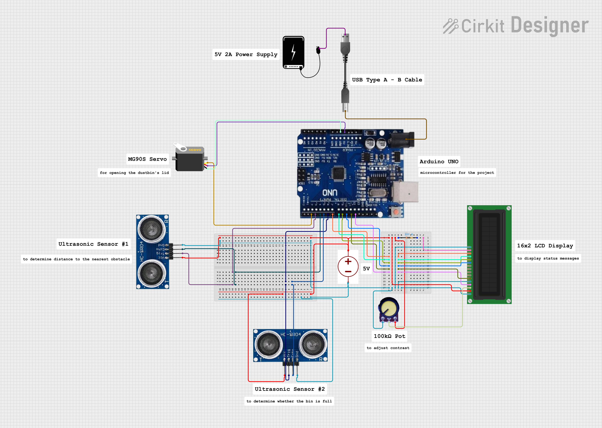

# Automated-Wastebin-SWEP2025
An Arduino-based automated waste bin using ultrasonic sensors, servo motors, and an LCD.

## Features
- Automatic lid opening when motion is detected
- LCD (16X2) display for status messages
- Dual ultrasonic sensors for accurate detection

## Components Used
- Arduino Uno
- MG996R Micro Servo
- HC-SR04 Ultrasonic Sensors (x2)
- 16x2 LCD Display
- Breadboard + Jumper wires
- 5V 2A USB Power Supply Unit

## Circuit Diagram
Here's the Ciruit Diagram.

You can view the circuit live [here](https://app.cirkitdesigner.com/project/e07abbf7-10a8-403c-8b51-ef054732fe02)

## Demo vid
(I'm the guy in pink, the person talking is my friend and colleague Osayi)

https://github.com/user-attachments/assets/a9fd78a1-dd2f-4948-8ef7-7cccd60b1824

## Collaborators 
This project wouldn't have been possible without help from my friends and colleagues, it was a group effort that led to the success of this project.\
[Onotoghene Kohwarien](https://github.com/Kohwarien-Onotoghene)\
[David Osayi](https://github.com/Just-Code-X)\
[Munachimso Henry](https://github.com/Draycole)

## License
This project is licensed under the MIT License.
